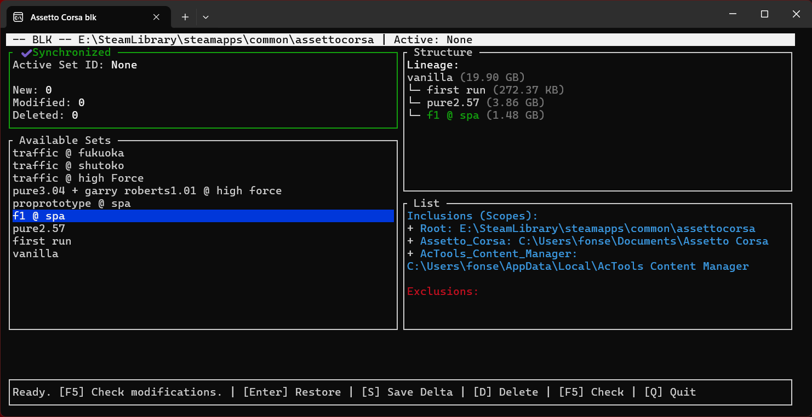
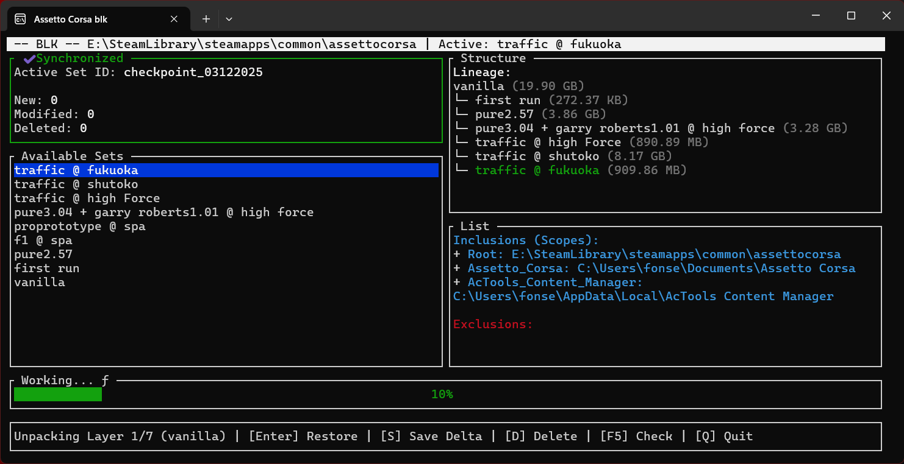

## BLK — Delta Engine for Massive Game & Asset Pipelines





**BLK** is a high-precision, delta snapshot engine designed for massive game folders, mod workflows, and creative pipelines. It solves the problem of maintaining "perfect states" in unstable environments.

---

## 🏎 The Nightmare Scenario (Why BLK exists)

Imagine yourself in **Assetto Corsa**. You have finally achieved the perfect setup:

> **Content Manager 0.8 + CSP 0.2.11 + PURE 0.2.57-P1**
> **+ BreakneckFX + DroneCam 1.2.2 + Extended Controlls + Telemetrick 1.7**

You are at **Spa Francorchamps** in your **VRC F1 Formula Alpha 2025**. The lighting is perfect. The physics are dialed in. It is the "State of the Art".

Then, you decide to update to **PURE 3.04**. 

Suddenly, the script breaks. Your controls are dead, Telemetrick crashes, and your BreakneckFX config is gone because the new mod overwrote a shared config file. **Pain.**

Neither the game launcher nor Steam can help you here. Steam verifies local files, but it ignores the configuration files scattered in `Documents` or `%AppData%`. Every new installation corrupts the delicate balance of the previous one.

**What if you could freeze that "State of the Art" moment?**
What if you could click one button and go back to the world exactly as you left it? Or switch entirely to a *"Shutoko Traffic / JDM"* profile without reinstalling 200GB of mods?

**With BLK, you can.**

---

## ⚡ Philosophy

BLK was created from a simple, painful truth: **When a game or asset pipeline grows beyond 50 GB, no existing tool handles versioning gracefully.**

* **Steam** only repairs the base folder (Vanilla).
* **Mod Managers** often overwrite files destructively.
* **Traditional Backups** weren’t built for this. They’re not click-and-play, and they often re-copy the entire 100 GB install just because a small change was made.
* **Git** chokes on massive binary trees.

BLK solves this by introducing **Global State Management**:

1.  **Deltas, not Duplicates:** It tracks *only* the differences (bytes) between states.
2.  **Scope Management:** Unlike Steam, BLK tracks external paths (e.g., `C:\Users\You\Documents\Assetto Corsa`) alongside the game root.
3.  **Nuclear Restoration:** When you switch profiles, BLK surgically removes files that don't belong to the target state. No "leftover junk" from old mods.

### The BLK Workflow

You don't just "backup" files. You manage parallel worlds:

```text
Vanilla (Base Game)
├── 📂 F1 Season Profile (Saved State)
│   ├── CSP 0.2.11 + Pure 0.2.57
│   ├── VRC Formula Alpha
│   └── (Includes your specific 'Documents/cfg' configs)
│
└── 📂 Shutoko Traffic Profile (Saved State)
    ├── CSP 0.2.3 preview + Pure 3.04
    ├── Traffic Planner + 50 JDM Cars
    └── (Different graphics settings & controls)

## ☢ Destructive by Design

BLK is not a traditional mod manager.

When you switch states, it performs a **nuclear wipe + rebuild** on the
configured scopes:

- It deletes files and directories that do not belong to the target snapshot
- Then it restores the files that do belong to that snapshot chain

If you scope BLK incorrectly (e.g. your entire user folder or system drives),
you will lose data. It is intended for carefully defined worlds: games,
mod stacks and toolchains that you can safely rebuild from snapshots.

## 🖼 Gallery / What BLK Shows

- **Change Detection**  
  BLK scans your mapped directories and detects exactly what changed since
  the last snapshot.

- **Delta Tree**  
  Visualize your history. Jump from Vanilla to a complex mod setup instantly.

- **Massive Data Handling**  
  Designed to handle 100GB+ installations reliably, as long as scopes are
  clearly defined.


## 🛠 Installation
Download the latest release (blk.exe).

Place blk.exe in the Root Folder of the game or project you want to manage (e.g., inside .../steamapps/common/assettocorsa).

Run blk.exe.

On the first run, it will automatically create a Vanilla snapshot of your current state.

Use the [C]onfig menu to add external folders (like Documents) using the format Name="C:\Path\To\Folder".

## 📜 License

BLK is released under the MIT License.  
See [`LICENSE`](./LICENSE) for the full text.